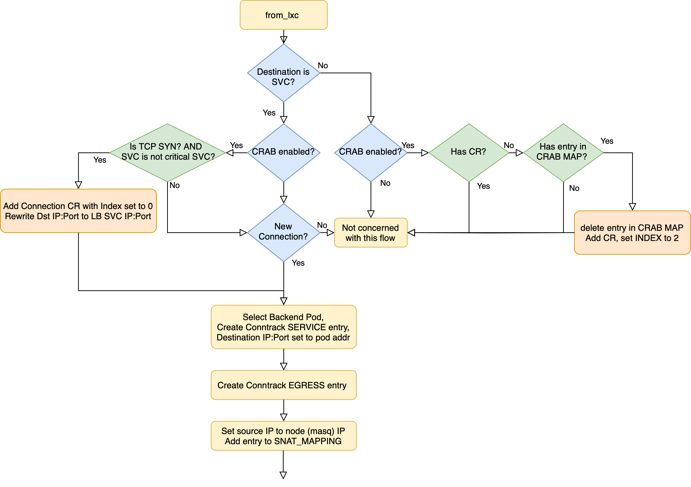
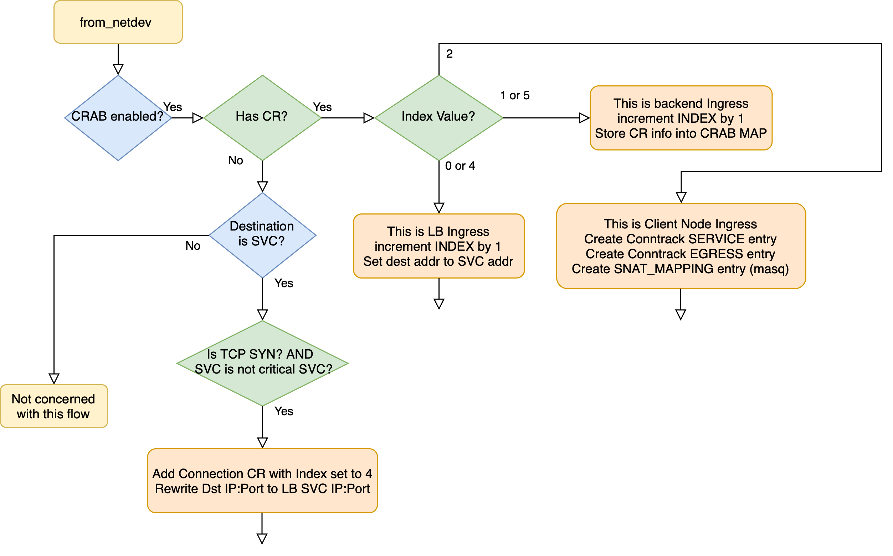

# CRAB in Cilium

This Project Combines CRAB Load Balancing with Cilium CNI.

## Installation & Run

`contrib/testing/kind-crab-values.yaml` is the configuration file. By setting `crab:enable` to `true` or `false`, you can enable or disable CRAB Load Balancing.

This project follows the [Cilium development guide](https://docs.cilium.io/en/latest/contributing/development/dev_setup/), please first make sure development environment is set up.

After the setup is done, deploy Cilium in `KinD` with:

```bash
make kind 
make kind-image
make kind-install-cilium
```
To delete the cluster:

```bash
make kind-down
```

User can Deploy any desired workloads in the cluster. Two files are provided for testing the load balancing: `workload.yaml` and `eval-workload.yaml`.

## Know More About This
To grasp the intricacies of this project, familiarize yourself with [Kubernetes Service](https://kubernetes.io/docs/concepts/services-networking/service/), especially ClusterIP and NodePort Service.

For a deeper dive:

- The [Cilium Official Guide](https://docs.cilium.io/en/v1.9/concepts/ebpf/lifeofapacket/) provides a holistic view.
- A detailed, step-by-step breakdown can be found in this [Life of a Packet - Pod to Service](http://arthurchiao.art/blog/cilium-life-of-a-packet-pod-to-service/) guide. (Note: In section 7.2, the call should be to `handle_policy`.)
- For insights on the functions executed when a SYN packet is sent from a pod to a service, refer to `/crab/calls.txt`.

Modifications in this project are predominantly focused on the Cilium eBPF C code's datapath behavior. Searching for `ENABLE_CRAB` in the codebase will highlight all the crab logic additions to the datapath. For a visual representation of the flow, refer to the figures:




## To further develop this project

To retrieve the `cilium-agent` pod name, use:

```bash
kubectl get pods -o wide -n kube-system
```

The commit `898d1fa538c7a7ec24a23802f61bb9073d874321` introduces `#ENABLE_CRAB` to `node_config.h`, enabling CRAB via a precompilation flag. There's potential to extend this, perhaps to declare a static LB IP.
The node's default directory for `node_config.h` is `/var/run/cilium/state/globals`. 


To obtain debugging information from Cilium, which includes outputs from the `cilium_dbg` functions, run:

```bash
kubectl exec -it <cilium-agent> -n kube-system -- sh -c "cilium monitor -j" > local_file.json
```

If a modified eBPF program fails its verification, diagnose the issue with:

```bash
k logs <cilium-44m4w> -n kube-system > logs.txt
```

